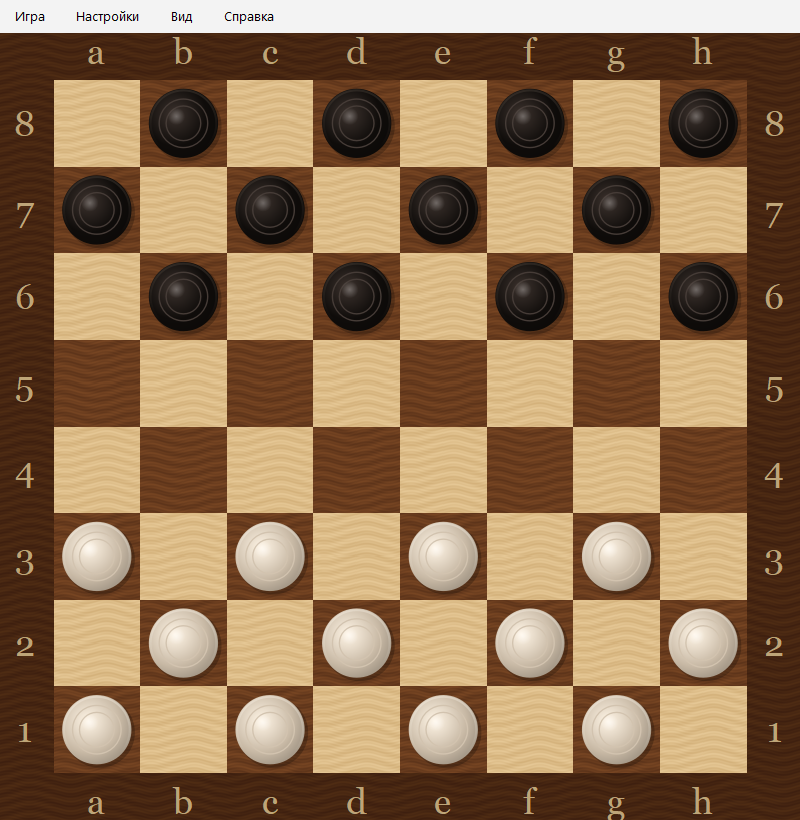

# Русские шашки

Игра в русские шашки с компьютерным противником на базе алгоритма alpha-beta minimax.



## Особенности

- **Классические русские шашки** — полная реализация правил: обязательное взятие, множественные прыжки, дамки на любое расстояние
- **Алгоритмический ИИ** — alpha-beta pruning minimax с настраиваемой глубиной поиска (1–10 полуходов)
- **Адаптивная сложность** — глубина автоматически подстраивается под фазу игры: ограничена в дебюте (много фигур), увеличена в эндшпиле
- **Три уровня сложности** — Любитель, Нормал, Профессионал
- **Реалистичная графика** — процедурные текстуры дерева и 3D-шашки с освещением
- **Сохранение и загрузка** — партии сохраняются в формате JSON
- **Просмотр партии** — пошаговое воспроизведение всех ходов

## Требования

- Python 3.12+
- PyQt6 >= 6.5
- NumPy >= 1.26

## Установка и запуск

```bash
# Клонирование
git clone https://github.com/adugin/draughts.git
cd draughts

# Установка зависимостей
pip install -r requirements.txt

# Запуск
python main.py
```

## Как играть

Вы играете **белыми** (снизу), компьютер — **чёрными** (сверху).

### Управление мышью

| Действие | Описание |
|----------|----------|
| **Левая кнопка** | Выбрать шашку / указать конечную позицию хода |
| **Правая кнопка** | Отметить промежуточную позицию при множественном взятии |

### Простой ход

1. Щёлкните левой кнопкой по своей шашке — она выделится.
2. Щёлкните левой кнопкой по клетке, куда хотите пойти.

### Взятие (обязательно!)

1. Щёлкните левой кнопкой по шашке, которая будет бить.
2. Одиночное взятие — щёлкните левой кнопкой по конечной клетке.
3. Множественное взятие — отметьте промежуточные клетки **правой** кнопкой, конечную — **левой**.

### Правила

- Шашки ходят по диагонали на одну клетку вперёд
- Дамка ходит на любое расстояние по диагонали
- Взятие **обязательно** — если можно побить, вы обязаны это сделать
- Шашка становится дамкой, достигнув последнего ряда
- Побеждает тот, кто побил все шашки противника или лишил его возможности хода

## Горячие клавиши

| Клавиша | Действие |
|---------|----------|
| `Ctrl+N` | Новая игра |
| `Ctrl+O` | Открыть сохранённую партию |
| `Ctrl+S` | Сохранить партию |
| `Ctrl+Z` | Отмена хода (только на уровне «Любитель») |
| `Ctrl+P` | Настройки |
| `Ctrl+R` | Просмотр партии |
| `F1` | Справка |

## Настройки

Доступны через меню **Настройки → Опции** (`Ctrl+P`):

| Параметр | Описание |
|----------|----------|
| **Сложность** | Любитель / Нормал / Профессионал — определяет глубину поиска AI |
| **Глубина поиска** | 0 = авто (из сложности), 1–10 = ручная настройка |
| **Подсказка взятия** | Подсвечивать, когда взятие обязательно |
| **Задержка** | Пауза между ходами для наглядности |
| **Играть чёрными** | Поменяться сторонами с компьютером |

## Архитектура

```
draughts/
├── game/
│   ├── board.py        # Доска: NumPy int8 массив 9x9, правила, ходы, взятия
│   ├── ai.py           # AI: alpha-beta minimax, статическая оценка позиции
│   ├── controller.py   # Контроллер: логика игры, ходы, AI-поток, save/load
│   └── save.py         # Сохранение/загрузка партий (JSON)
├── ui/
│   ├── main_window.py  # Главное окно: доска + меню
│   ├── board_widget.py # Виджет доски: отрисовка, обработка кликов
│   ├── textures.py     # Процедурные текстуры дерева и 3D-шашки
│   ├── dialogs.py      # Диалоги: опции, справка, об авторе
│   └── playback.py     # Просмотр партии
├── resources/
│   ├── help.txt        # Справочная информация
│   └── messages.txt    # Фразы AI во время раздумий
└── config.py           # Константы, настройки, пути
```

### Кодировка доски

Доска хранится как `np.ndarray((9, 9), dtype=np.int8)` с 1-индексацией:

| Значение | Фигура |
|----------|--------|
| `0` | Пусто |
| `1` | Чёрная шашка |
| `2` | Чёрная дамка |
| `-1` | Белая шашка |
| `-2` | Белая дамка |

Знаковая кодировка позволяет использовать `grid > 0` для поиска чёрных, `grid < 0` для белых, и `a * b < 0` для проверки противника.

### AI

Алгоритм **alpha-beta pruning minimax** с:
- **Статической оценкой** — материал (пешка=5, дамка=15), продвижение к дамочной линии, контроль центра, мобильность, угрозы
- **Move ordering** — захваты первыми, затем по эвристике (для лучшего отсечения)
- **Адаптивной глубиной** — ограничение в дебюте (>16 фигур → макс. 4), углубление в эндшпиле (<=6 фигур → +2)
- **Штрафом за подставки** — ходы, после которых противник может бить, получают штраф

## Разработка

```bash
# Тесты
python -m pytest tests/ -q

# Линтер
ruff check draughts/ tests/

# Форматирование
ruff format draughts/ tests/

# Бенчмарк AI
python benchmark.py --depth 8 --profile
```

## Лицензия

Этот проект создан в образовательных целях как переосмысление оригинальной программы «Шашки», написанной на Borland Pascal 7.0 в 1998–2000 годах.

## Автор

**Andrey Dugin** — автор оригинальной программы и текущей версии.
