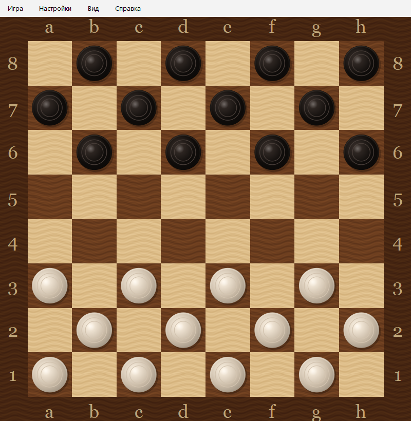

# Русские шашки

Игра в русские шашки с компьютерным противником на базе alpha-beta minimax.



## Особенности

- **Классические русские шашки** — полная реализация правил FMJD: обязательное взятие, множественные прыжки, дамки на любое расстояние. Ничья: 3-кратное повторение, 1K vs 1K, треугольник Петрова (2K vs 1K), 15-ходовое правило для дамок, 30-ходовое правило без прогресса.
- **6 уровней сложности** — от Новичка (~1500 Elo) до Мастера (~1750 Elo) — измерено self-play 300-игровым anchor-турниром (anchored L4=1700). Подробности калибровки — `draughts/game/ai/elo.py`.
- **Алгоритмический ИИ** — alpha-beta с TT (Zobrist), iterative deepening, quiescence search, LMR, killer moves, история.
- **Дебютная книга** — ~47 000 позиций (self-play + импорт из PDN).
- **Эндшпильная база** — 399 280 позиций 3 фигур в поставке; база на 4 фигуры (~126 МБ) скачивается через меню **Инструменты** из GitHub Releases.
- **Texel-тюнинг** — веса оценки оптимизированы автоматически через self-play.
- **PDN 3.0 + RAV** — сохранение, загрузка, варианты с подвариантами, комментарии `{...}` и NAG-метки. База партий PDN (**Ctrl+D**) — сортируемая таблица.
- **FEN** — копирование и вставка позиций через буфер обмена (**Ctrl+Shift+C / V**).
- **DXP-протокол** — `python -m draughts.engine --dxp --port 27531` поднимает FMJD DXP-сервер; совместимо с CheckerBoard / Dam 3.0.
- **Панель анализа** (F3) и **Дерево вариантов** (F4) — доки.
- **Анализ партии** — автоматические аннотации (`!!`, `!`, `?!`, `?`, `??`) с графиком оценки.
- **Тренажёр задач** (**Ctrl+P**) — 129 встроенных + автомайнинг из собственных партий.
- **Редактор позиций** (**Ctrl+E**) — расстановка, FEN, валидация, «играть/анализировать отсюда».
- **Сменить сторону** (**Ctrl+F**) — поменяться цветом с компьютером в середине партии.
- **Просмотр партии** (**Ctrl+R**) — воспроизвести все ходы.
- **7 тем оформления** — TOML-движок: dark wood, classic light, Nord, Dracula, Gruvbox, Catppuccin, Solarized.
- **Реалистичная графика** — процедурные текстуры дерева, 3D-шашки с освещением.
- **i18n-инфраструктура** — каталоги RU/EN (`DRAUGHTS_LOCALE=en`).
- **Сохранение настроек** — предпочтения сохраняются между сеансами.

## Требования

- Python 3.12+
- PyQt6 >= 6.5
- NumPy >= 1.26

## Установка и запуск

```bash
# Клонирование
git clone https://github.com/adugin/draughts.git
cd draughts

# Установка зависимостей
pip install -r requirements.txt

# Запуск
python main.py
```

### Параметры командной строки

```bash
python main.py                    # Новая игра
python main.py game.pdn           # Загрузить партию из PDN-файла
python main.py --resume            # Продолжить прерванную партию
python main.py --difficulty 5      # Уровень сложности (1–6)
python main.py --black             # Играть чёрными
python main.py --version           # Показать версию
```

## Как играть

Вы играете **белыми** (снизу), компьютер — **чёрными** (сверху).

### Управление мышью

| Действие | Описание |
|----------|----------|
| **Левая кнопка** | Выбрать шашку / указать позицию хода / промежуточное взятие |
| **Правая кнопка** | Отменить выбор шашки |

### Простой ход

1. Щёлкните левой кнопкой по своей шашке — она выделится.
2. Щёлкните левой кнопкой по клетке, куда хотите пойти.

### Взятие (обязательно!)

1. Щёлкните левой кнопкой по шашке, которая будет бить.
2. Щёлкните левой кнопкой по конечной клетке — взятие выполнится автоматически.
3. Если путь неоднозначен — промежуточные точки указываются левым кликом.

### Правила

- Шашки ходят по диагонали на одну клетку вперёд
- Дамка ходит на любое расстояние по диагонали
- Взятие **обязательно** — если можно побить, вы обязаны это сделать
- Шашка становится дамкой, достигнув последнего ряда (продолжает бить как дамка)
- Побеждает тот, кто побил все шашки противника или лишил его возможности хода
- Ничья: 3-кратное повторение, 1K vs 1K, 2K vs 1K, 15 ходов только дамками, 30 ходов без взятий

## Горячие клавиши

| Клавиша | Действие |
|---------|----------|
| `Ctrl+N` | Новая игра |
| `Ctrl+O` | Открыть партию |
| `Ctrl+S` | Сохранить партию |
| `Ctrl+D` | База партий (PDN) |
| `Ctrl+Z` | Отмена хода |
| `Ctrl+H` | Подсказка лучшего хода с principal variation |
| `Ctrl+F` | Сменить сторону |
| `Ctrl+,` | Опции |
| `Ctrl+E` | Редактор позиций |
| `Ctrl+Shift+C` | Копировать FEN позиции |
| `Ctrl+Shift+V` | Вставить FEN позиции |
| `F3` | Панель анализа |
| `F4` | Дерево вариантов |
| `Ctrl+R` | Просмотр партии |
| `Ctrl+P` | Тренажёр задач |
| `F1` | Справка |
| `Escape` | Отмена (в редакторе) |
| `Alt+F4` | Выход |

## Настройки

Доступны через меню **Игра → Опции** (`Ctrl+,`). Сохраняются автоматически.

### Вкладка «Игра»
| Параметр | Описание |
|----------|----------|
| Сторона | Играть белыми или чёрными |
| Уровень | 1 = Новичок ... 6 = Мастер (аспирационные метки; измеренный Elo-спред 1517–1747) |
| Подсказка взятия | Подсвечивать обязательные взятия |

### Вкладка «Движок»
| Параметр | Описание |
|----------|----------|
| Хэш-таблица | Размер таблицы транспозиций (1–1024 МБ, default 64) |
| Дебютная книга | Использовать книгу дебютов |
| Эндшпильная база | Использовать базу эндшпилей |

### Вкладка «Интерфейс»
| Параметр | Описание |
|----------|----------|
| Тема оформления | 7 тем на выбор |
| Координаты | Буквы и цифры вокруг доски |
| Подсветка хода | Маркер последнего хода |
| Возможные ходы | Точки при наведении курсора |

## Разработка

```bash
# Тесты
python -m pytest tests/ -q

# Линтер
ruff check draughts/ tests/

# Форматирование
ruff format draughts/ tests/

# Бенчмарк AI
python benchmark.py --depth 8 --profile
```

## Лицензия

Этот проект создан в образовательных целях как переосмысление оригинальной программы «Шашки», написанной на Borland Pascal 7.0 в 1998–2000 годах.

## Автор

**Andrey Dugin** — автор оригинальной программы и текущей версии.
